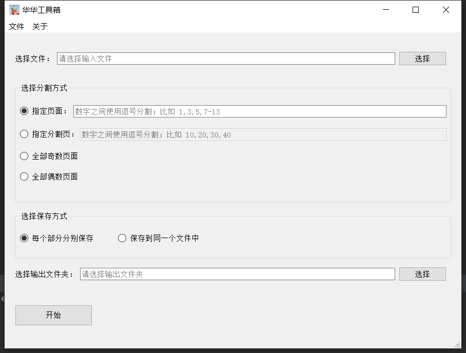

# doc-tools

基于老婆的要求，写了一个分割文档的小工具，带界面（PyQT5）。

    python 3.9.7

具体依赖参见 [requirements.txt](./requirements.txt)

截图：

## 功能列表

### 分割 pdf 文档

抽取模式：

1. 抽取多个指定页码。
2. 抽取多个指定页码范围。
3. 指定分割点页码。
4. 抽取偶数页码或者奇数页面。

(说明：“页码”为页面在文档内的第几页，而不是文档目录所标注的第几页)

保存模式：

1. 将每一份抽取内容分别保存到各自的文件中。
2. 将所有抽取内容保存为单个文件。

### ChangeLog

##### 0.0.1 / 20220521
1. 支持基本的抽取模式

### Issues

联系方式：xesam@outlook.com

